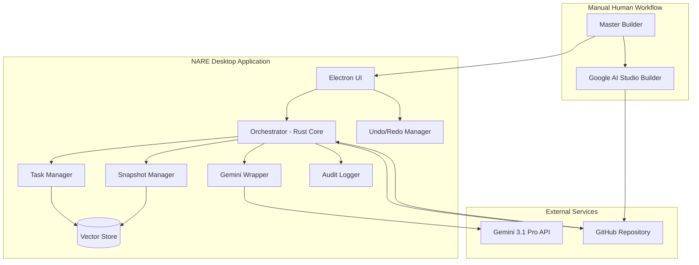
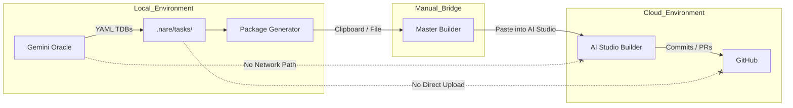
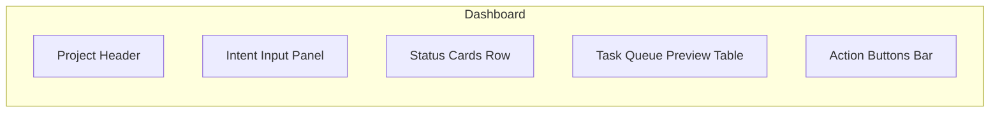
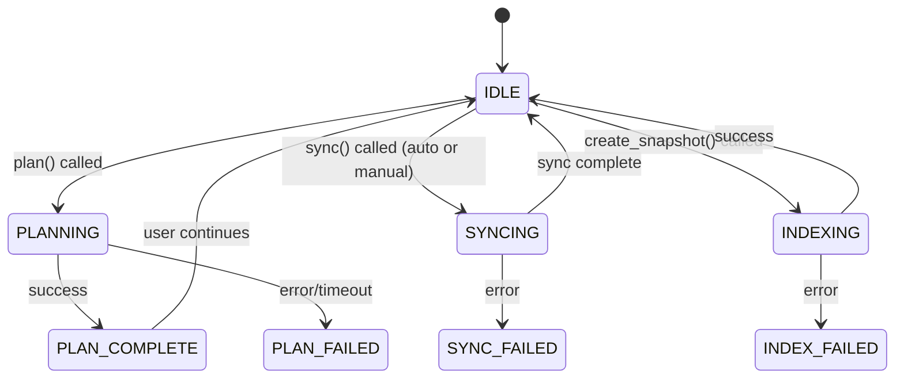

# Normative Implementation Specification for NARE HITL Edition (AI Studio Builder + GitHub Integration)

**Document ID:** NARE-HITL-SPEC-2.0.0  
**Version:** 2.0.0 (Final)  
**Status:** Approved  
**Date:** 2026-04-13  
**Classification:** Normative Implementation Specification  
**Target Platform:** Cross‑platform Desktop Application (Electron + Rust Backend)  

---

## 1. Scope

### 1.1 Purpose
This document defines the complete implementation of the **NARE Human‑in‑the‑Loop (HITL) Edition**. The system is a local desktop application that automates the **Planning** phase of the NARE protocol and assists the Master Builder in executing refactoring tasks via **Google AI Studio Builder** (GitHub‑connected). All code actuation occurs externally in AI Studio; the local application manages snapshots, embeddings, Oracle invocation, task generation, package export, and repository synchronization.

### 1.2 Guiding Principles
- **Air‑Gap Preservation:** The Oracle AI never communicates with the Implementer AI. All data transfer is mediated by the Master Builder through explicit file export/import or clipboard operations.
- **Deterministic User Experience:** Every button, menu item, and keyboard shortcut is specified. Undo/redo is supported for all user‑initiated state changes.
- **Full Auditability:** Every action that modifies the local repository state or task queue is logged immutably.
- **Zero Ambiguity:** This specification leaves no implementation decision to the developer. All behaviors are fully enumerated.

---

## 2. Normative References

| Identifier | Title | Version / Date |
| :--- | :--- | :--- |
| NARE-SPEC | NARE Protocol Specification | v1.2.0 (2026-04-12) |
| NARE-ORACLE | NARE Oracle System Instructions | v1.0 (2026-04-13) |
| NARE-IMPL | NARE Implementer System Instructions | v1.0 (2026-04-13) |
| GEMINI-API | Google Gemini API Documentation | 2026-04-01 |
| AI-STUDIO | Google AI Studio Builder Documentation | 2026-04-01 |
| GITHUB-API | GitHub REST API v3 | 2026-04-01 |
| JSON-SCHEMA | JSON Schema Specification | Draft 2020-12 |

---

## 3. Definitions and Acronyms

| Term | Definition |
| :--- | :--- |
| **Master Builder** | The human operator of the NARE application. |
| **Intent** | Plain‑English description of the desired code change. |
| **Canonical Snapshot** | An immutable, version‑controlled representation of the codebase at a specific commit, stored as chunked embeddings. |
| **Tela Task** | An atomic unit of work defined by a YAML TDB. |
| **Oracle** | The Gemini‑powered AI that decomposes Intent into Tela Tasks. |
| **Implementer** | The AI Studio Builder agent that executes Tela Tasks and creates GitHub commits/PRs. |
| **Package** | A plain‑text bundle containing the NARE Implementer System Instructions and one or more Tela Task YAML documents, intended for pasting into AI Studio. |
| **Workspace** | The local Git repository managed by NARE. |
| **Undo Stack** | A LIFO stack of reversible user actions (excluding external side effects like Git commits). |
| **Redo Stack** | A LIFO stack of actions that have been undone and can be reapplied. |

---

## 4. System Architecture

### 4.1 High‑Level Component Diagram



### 4.2 Air‑Gap Enforcement



The Oracle never has access to the execution environment. The Implementer never has access to the local snapshot or the original Intent. The Master Builder is the sole conduit.

---

## 5. User Interface Specification

The UI is a single‑page Electron application with a left sidebar navigation and a main content area. All UI state is managed via Redux (or equivalent) and persisted to `~/.nare/ui_state.json` between sessions.

### 5.1 Global UI Elements

| Element | Location | Behavior |
| :--- | :--- | :--- |
| **Menu Bar** | Top (OS native) | File, Edit, View, Window, Help menus (see §5.1.1). |
| **Status Bar** | Bottom | Left: Current application state (e.g., `IDLE`, `PLANNING`, `SYNCING`). Center: Last action description. Right: Git branch and commit SHA. |
| **Notification Center** | Bottom‑right toast | Disappears after 5 seconds. History accessible via bell icon. |
| **Undo/Redo** | Edit menu or Ctrl+Z / Ctrl+Shift+Z | Reverts/restores the last reversible action within the application. |

#### 5.1.1 Menu Bar Specification

**File Menu**
| Item | Shortcut | Enabled When | Action |
| :--- | :--- | :--- | :--- |
| New Project... | Ctrl+N | Always | Opens project creation wizard. |
| Open Project... | Ctrl+O | Always | Opens directory picker to select existing NARE project. |
| Close Project | Ctrl+W | Project open | Closes current project, returns to welcome screen. |
| Recent Projects | > | Always | Submenu listing last 10 projects. |
| --- | | | |
| Export Package... | Ctrl+E | Tasks exist | Opens Package Export View. |
| Import Tasks... | Ctrl+I | Project open | Imports externally edited YAML tasks into queue. |
| --- | | | |
| Settings... | Ctrl+, | Always | Opens Settings View. |
| --- | | | |
| Exit | Alt+F4 | Always | Closes application after confirmation if unsaved changes. |

**Edit Menu**
| Item | Shortcut | Enabled When | Action |
| :--- | :--- | :--- | :--- |
| Undo | Ctrl+Z | Undo stack non‑empty | Reverts last reversible action. |
| Redo | Ctrl+Shift+Z | Redo stack non‑empty | Restores last undone action. |
| --- | | | |
| Cut | Ctrl+X | Text field focused | System cut. |
| Copy | Ctrl+C | Text selected or table row selected | System copy. For task table, copies selected task YAML. |
| Paste | Ctrl+V | Text field focused | System paste. |
| --- | | | |
| Select All | Ctrl+A | List/table focused | Selects all items. |
| --- | | | |
| Find | Ctrl+F | Anywhere | Opens search bar for current view. |

**View Menu**
| Item | Shortcut | Action |
| :--- | :--- | :--- |
| Dashboard | Ctrl+1 | Navigate to Dashboard. |
| Tasks | Ctrl+2 | Navigate to Task Manager View. |
| Snapshots | Ctrl+3 | Navigate to Snapshot Manager View. |
| Logs | Ctrl+4 | Navigate to Audit Log Viewer. |
| --- | | | |
| Toggle Sidebar | Ctrl+B | Collapses/expands left sidebar. |
| --- | | | |
| Zoom In | Ctrl+= | Increases UI scale. |
| Zoom Out | Ctrl+- | Decreases UI scale. |
| Reset Zoom | Ctrl+0 | Resets to 100%. |

**Window Menu** (standard OS items)  
**Help Menu**
| Item | Action |
| :--- | :--- |
| Documentation | Opens NARE protocol docs in browser. |
| Check for Updates... | Queries latest release. |
| About NARE | Shows version and license info. |

### 5.2 Sidebar Navigation

The left sidebar is always visible (unless toggled off). It contains:

| Icon | Label | Description |
| :--- | :--- | :--- |
| 🏠 | Dashboard | Main project overview and Intent input. |
| ✅ | Tasks | Detailed task management view. |
| 📸 | Snapshots | Snapshot history and management. |
| 📦 | Packages | Export history and package management. |
| 📜 | Logs | Audit log viewer. |

### 5.3 Dashboard View

This is the primary landing view after opening a project.



#### 5.3.1 Project Header

| Element | Type | Behavior |
| :--- | :--- | :--- |
| **Project Name** | Text | Derived from repo folder name. Click to reveal path. |
| **Git Branch** | Dropdown | Lists local branches. Switching triggers checkout and snapshot staleness. |
| **Last Sync** | Timestamp | Hover shows full datetime. Click to force sync. |
| **Snapshot Status** | Badge | `CURRENT` (green), `STALE` (yellow), `MISSING` (red). Click opens Snapshot Manager. |

#### 5.3.2 Intent Input Panel

| Element | Type | Behavior |
| :--- | :--- | :--- |
| **Intent Label** | Static text | "What change do you want to make?" |
| **Intent Textarea** | Multi‑line input | Max 2000 characters. Shows character count. Auto‑saves draft to `~/.nare/drafts/` every 5 seconds. |
| **Clear Button** | Button (X icon) | Clears textarea. Undoable. |
| **Use Template** | Dropdown | Pre‑filled intent templates (e.g., "Refactor module to use pattern X", "Add unit tests for Y"). Selecting populates textarea. |
| **Plan Button** | Primary button | Triggers Phase 1: Planning. Disabled if snapshot not `CURRENT` or Intent empty. Shows spinner during planning. Undoable (aborts planning and reverts task generation). |

#### 5.3.3 Status Cards Row

Three cards displaying key metrics:

| Card | Content | Click Action |
| :--- | :--- | :--- |
| **Snapshot** | Chunk count, total files, last indexed | Opens Snapshot Manager. |
| **Tasks** | Pending / Awaiting Human / Completed counts | Navigates to Tasks View. |
| **Packages** | Number of exported packages this sprint | Navigates to Packages View. |

#### 5.3.4 Task Queue Preview Table

A compact table showing the first 5 pending/awaiting tasks.

| Column | Description |
| :--- | :--- |
| **ID** | Short task identifier (e.g., `refactor‑001`). |
| **Target** | Primary file path. |
| **Status** | Badge (`PENDING`, `AWAITING_HUMAN`, `COMPLETED`). |
| **Actions** | ⏻ (View YAML), 📋 (Copy YAML), ✏ (Edit), 🗑 (Delete). |

- **View YAML:** Opens a read‑only modal with syntax‑highlighted YAML.
- **Copy YAML:** Copies full TDB to clipboard.
- **Edit:** Opens Task Editor modal (see §5.4.2). Undoable.
- **Delete:** Moves task to trash (soft delete). Undoable.

A "View All Tasks" link at the bottom navigates to Tasks View.

#### 5.3.5 Action Bar

| Button | Enabled When | Action |
| :--- | :--- | :--- |
| **Generate Package...** | ≥1 task with status `PENDING` | Opens Package Export View. |
| **Sync Now** | Always | Manually triggers repository sync (see §6.4). |
| **Refresh Snapshot** | Snapshot `STALE` or `MISSING` | Rebuilds snapshot from current workspace. |

### 5.4 Tasks View

A full‑featured task management interface.

#### 5.4.1 Task Table

Columns (sortable, filterable):

| Column | Description | Filter Options |
| :--- | :--- | :--- |
| **Select** | Checkbox for batch operations. | — |
| **Task ID** | Unique identifier. | Text search. |
| **Intent Summary** | One‑line description. | Text search. |
| **Target Files** | Comma‑separated list. | Text search. |
| **Status** | Badge. | Multi‑select dropdown. |
| **Created** | ISO timestamp. | Date range picker. |
| **Last Modified** | ISO timestamp. | Date range picker. |
| **Attempts** | Revision count. | Numeric range. |
| **Actions** | Buttons (see below). | — |

**Per‑Row Actions:**
- 👁 **View:** Opens read‑only YAML modal.
- ✏ **Edit:** Opens Task Editor modal.
- 📋 **Copy:** Copies YAML to clipboard.
- 🗑 **Delete:** Soft delete (moves to Trash).
- 🔄 **Reset Status:** Sets status back to `PENDING` (if `AWAITING_HUMAN` or `COMPLETED`). Undoable.
- 📤 **Export Single:** Exports only this task as a package.

**Batch Actions (appear when ≥1 row selected):**
- **Export Selected:** Generates package containing only selected tasks.
- **Delete Selected:** Soft deletes all selected.
- **Reset Selected:** Sets status of selected to `PENDING`.

**Toolbar Above Table:**
- **Filter Input:** Global text search across ID, summary, target.
- **Status Filter:** Dropdown multi‑select.
- **Clear Filters Button.**
- **Import Tasks Button:** Opens file picker for `.yaml` or `.txt` files containing Tela Tasks. Parses and adds to queue. Undoable.
- **New Task Button:** Opens Task Editor in creation mode (manual TDB entry).

#### 5.4.2 Task Editor Modal

Used for creating new tasks or editing existing ones. All changes are undoable.

| Field | Type | Validation |
| :--- | :--- | :--- |
| **Task ID** | Text input | Required, unique, slug format. |
| **Intent Summary** | Text input | Required. |
| **Target Files** | Multi‑entry input | At least one file path required. Each path must exist in snapshot. |
| **Boundary: Must** | Multi‑entry input | List of positive constraints. |
| **Boundary: Must Not** | Multi‑entry input | List of negative constraints. |
| **Verification: AST Check** | Command input | Must include `{file}` placeholder. |
| **Verification: Compiler Check** | Command input | Required. |
| **Verification: Behavioral Checks** | Dynamic list | Name + Command pairs. |
| **Surgery Method** | Dropdown | `deterministic_script` (default) or `patch_file`. |
| **Script Language** | Dropdown | Python, Bash, Node, etc. Enabled if method = script. |
| **Script Content** | Code editor | Syntax‑highlighted. Required if method = script. |

**Buttons:**
- **Save:** Validates and saves. If editing, creates a new revision (old version moved to history). Undoable.
- **Cancel:** Closes without saving.
- **Validate:** Runs schema validation without saving.
- **Preview YAML:** Shows rendered YAML in read‑only panel.

#### 5.4.3 Trash View

A separate tab within Tasks View showing soft‑deleted tasks.

| Column | Description |
| :--- | :--- |
| **Task ID** | Identifier. |
| **Deleted Date** | Timestamp of deletion. |
| **Actions** | ♻ Restore, 🗑 Permanently Delete. |

- **Restore:** Moves task back to active queue with status `PENDING`. Undoable.
- **Permanent Delete:** Removes from system entirely. Irreversible (confirmation required).
- **Empty Trash:** Permanently deletes all trashed tasks.

### 5.5 Snapshots View

Manages the Canonical Snapshot lifecycle.

#### 5.5.1 Current Snapshot Card

Displays details of the active snapshot:
- Created timestamp
- Git commit SHA
- Total files indexed
- Total chunks
- Total tokens (estimated)

**Buttons:**
- **Create New Snapshot:** Runs full indexing workflow. Disabled if already `CURRENT` and no changes. Undoable (rolls back to previous snapshot manifest).
- **Refresh Snapshot:** Updates snapshot from current workspace HEAD. Undoable.
- **Export Snapshot:** Downloads snapshot manifest + chunks as a `.nare‑snapshot` archive.

#### 5.5.2 Snapshot History Table

Lists all previous snapshots stored locally.

| Column | Description |
| :--- | :--- |
| **Timestamp** | When snapshot was created. |
| **Commit** | Git SHA (short). |
| **Files** | Count. |
| **Status** | `Active` (green) or `Archived`. |
| **Actions** | 👁 View, 🔄 Restore, 🗑 Delete. |

- **Restore:** Sets this snapshot as active. Triggers re‑index if needed. Undoable.
- **Delete:** Removes snapshot from history (does not affect vector store if chunks are still referenced).

#### 5.5.3 Embedding Configuration

Settings specific to this snapshot (editable, undoable):
- **Embedding Model:** Dropdown (local or cloud).
- **Chunk Size:** Number input (100‑1000 lines).
- **Chunk Overlap:** Number input (0‑50 lines).
- **Ignore Patterns:** Multi‑entry list (editable `.nareignore`).

**Re‑index Button:** Rebuilds chunks and embeddings using current config. Undoable.

### 5.6 Packages View

Tracks all exported packages.

#### 5.6.1 Package History Table

| Column | Description |
| :--- | :--- |
| **Export Date** | Timestamp. |
| **Tasks Included** | Count and list of task IDs (expandable). |
| **Exported By** | `user@host` or configured identity. |
| **Format** | `AI Studio Bundle`. |
| **Actions** | 👁 View, 📋 Copy, 📥 Download, 🗑 Delete. |

- **View:** Shows the exact text that was generated.
- **Copy:** Copies package text to clipboard.
- **Download:** Saves as `.txt` file.

#### 5.6.2 Generate Package Button

Opens the **Package Export View** (see §5.7).

### 5.7 Package Export View

This is a modal/dialog that guides the Master Builder through the export process.

#### 5.7.1 Step 1: Select Tasks

| Element | Type | Behavior |
| :--- | :--- | :--- |
| **Task Selection Table** | Checkbox table | Shows all `PENDING` and `AWAITING_HUMAN` tasks. Default: all `PENDING` checked. |
| **Select All / None** | Links | Toggles selection. |
| **Included Count** | Text | Updates dynamically. |

#### 5.7.2 Step 2: Configure Package

| Element | Type | Behavior |
| :--- | :--- | :--- |
| **Package Name** | Text input | Default: `nare_package_YYYY‑MM‑DD_HHMM`. |
| **Include Instructions** | Checkbox | Default: checked. Includes human‑readable steps. |
| **Include System Instructions** | Checkbox | Default: checked. Includes full NARE‑IMPL system prompt. |
| **GitHub Repo URL** | Read‑only text | Displays the configured repo. |
| **Copy to Clipboard After Generate** | Checkbox | Default: checked. Automatically copies after generation. |

#### 5.7.3 Step 3: Preview and Export

| Element | Type | Behavior |
| :--- | :--- | :--- |
| **Package Preview** | Read‑only text area | Shows the exact package content. Updates live as options change. |
| **Copy Button** | Button | Copies content to clipboard. |
| **Download Button** | Button | Saves as `.txt` file. |
| **Done Button** | Button | Closes modal and marks exported tasks as `AWAITING_HUMAN`. Undoable (can revert status). |

#### 5.7.4 Package Content Template

```
===============================================================================
NARE IMPLEMENTER PACKAGE
Generated: {timestamp}
Project: {repo_url}
Tasks Included: {task_ids_comma}
===============================================================================

--- MASTER BUILDER INSTRUCTIONS ---
1. Open Google AI Studio Builder: https://aistudio.google.com/
2. Ensure your project is connected to the GitHub repository: {repo_url}
3. Go to the "System Instructions" section. If you have not already configured it, paste the content under "NARE IMPLEMENTER SYSTEM INSTRUCTIONS" below.
4. In the user prompt, enter: "Execute the Tela Tasks defined below."
5. Run the agent. It will create commits and/or a pull request.
6. After the run completes, review the changes and merge the PR.
7. Return to the NARE application and click "Sync Now" to update the snapshot.

===============================================================================
=== NARE IMPLEMENTER SYSTEM INSTRUCTIONS ===
{Copy the EXACT content of Implementer-System-Instructions.md here}
=== END SYSTEM INSTRUCTIONS ===

===============================================================================
=== TELA TASKS PAYLOAD ===
{For each selected task, in order:}
{task YAML content}
---
===============================================================================
```

**Critical:** The System Instructions section is included **once** per package, not repeated per task. The Master Builder may choose to omit it if AI Studio already has the instructions saved.

### 5.8 Logs View

Displays the immutable audit log stored in `.nare/logs/audit.jsonl`.

#### 5.8.1 Log Table

| Column | Description | Filter |
| :--- | :--- | :--- |
| **Timestamp** | ISO 8601 with ms. | Date range. |
| **Level** | INFO, WARN, ERROR. | Multi‑select. |
| **Component** | Orchestrator, Snapshot, Oracle, UI. | Multi‑select. |
| **Action** | e.g., `PLAN_START`, `TASK_CREATED`, `PACKAGE_EXPORTED`. | Text search. |
| **Details** | JSON payload (expandable). | — |

#### 5.8.2 Export Logs Button

Exports filtered logs as JSON or CSV.

### 5.9 Settings View

#### 5.9.1 API Keys Section

| Setting | Type | Description |
| :--- | :--- | :--- |
| **Gemini API Key** | Password | Stored in OS keychain. Test button validates key. |
| **GitHub Personal Access Token** | Password | Stored in OS keychain. Requires `repo` scope. Test button validates. |

#### 5.9.2 Repository Section

| Setting | Type | Description |
| :--- | :--- | :--- |
| **GitHub Repository URL** | Text | e.g., `https://github.com/user/repo`. |
| **Local Workspace Path** | Directory picker | Where the repo is cloned. |
| **Default Branch** | Text | e.g., `main`. |

#### 5.9.3 Oracle Settings

| Setting | Type | Default |
| :--- | :--- | :--- |
| **Model** | Dropdown | `gemini-3.1-pro` |
| **Temperature** | Slider (0‑1) | `0.0` |
| **Max Output Tokens** | Number | `8192` |
| **Long‑Context Mode** | Dropdown | `Auto`, `Map‑Reduce`, `Single‑Pass`. |

#### 5.9.4 Snapshot Defaults

| Setting | Type | Default |
| :--- | :--- | :--- |
| **Embedding Model** | Dropdown | `all-MiniLM-L6-v2` (local) |
| **Chunk Size** | Number | `200` |
| **Chunk Overlap** | Number | `20` |
| **Auto‑Sync Interval** | Number (seconds) | `60` (0 to disable) |

#### 5.9.5 UI Settings

| Setting | Type | Default |
| :--- | :--- | :--- |
| **Theme** | Dropdown | `System`, `Light`, `Dark` |
| **Font Size** | Slider | `14px` |
| **Show System Instructions in Package** | Checkbox | `true` |
| **Auto‑Copy Package** | Checkbox | `true` |

**Save Button:** Persists all settings. May require application restart for some changes.

---

## 6. Orchestrator Specification

The Orchestrator is the Rust backend that manages state, invokes external services, and communicates with the UI via JSON‑RPC over IPC.

### 6.1 State Machine



**Note:** Task execution is external; the Orchestrator does not have an `EXECUTING` state. Instead, tasks transition from `PENDING` to `AWAITING_HUMAN` after package export, and to `COMPLETED` after a successful sync detects the changes.

### 6.2 Phase 1: Planning

**RPC Method:** `orchestrator.plan(intent: string) -> PlanResult`

**Preconditions:**
- Snapshot status == `CURRENT`
- `intent` non‑empty

**Procedure:**
1. Log `PLAN_START` with intent hash.
2. Retrieve active snapshot manifest.
3. Generate embedding of `intent` using configured model.
4. Query vector store for top‑K similar chunks (K = min(20, total_chunks)).
5. For each chunk, fetch content and metadata.
6. Assemble Oracle prompt (see §6.3.1).
7. Invoke Gemini API with prompt (timeout: 120s).
8. Parse response stream. Extract all YAML code fences.
9. For each YAML block:
   - Validate against NARE Task Schema.
   - If valid, create task with unique UUID, status `PENDING`.
   - Save to `.nare/tasks/<uuid>.yaml`.
   - Log `TASK_CREATED` with task ID.
10. If zero valid tasks: retry once with error clarification. On second failure, log `PLAN_FAILED` and return error.
11. Log `PLAN_COMPLETE` with task count.
12. Push undo action that deletes all created tasks.

**Error Handling:**
- API rate limit: exponential backoff (1s, 2s, 4s, 8s). Max 4 retries.
- Context length exceeded: automatically switch to map‑reduce mode (chunk analysis then aggregation).
- Invalid YAML: skip block, continue.

### 6.3 Oracle Prompt Templates

#### 6.3.1 Planning Prompt

```
[SYSTEM]
{NARE-ORACLE System Instructions verbatim}
[/SYSTEM]

[CONTEXT]
The following code chunks are retrieved from the project snapshot.

{For each chunk:}
--- FILE: {file_path} (lines {start}-{end}) ---
{content}
---
[/CONTEXT]

[INTENT]
{user_intent}
[/INTENT]

Generate an ordered sequence of YAML Tela Tasks conforming to NARE Task Schema v4.1.0. Enclose each task in a ```yaml code fence.
```

#### 6.3.2 Revision Prompt

```
[SYSTEM]
{NARE-ORACLE System Instructions verbatim}
[/SYSTEM]

[CONTEXT]
(Same chunks as original plan)
[/CONTEXT]

[INTENT]
{original_intent}
[/INTENT]

[FAILURE REPORT]
The following task was reported as failed or incorrect by the Master Builder.

Original Task YAML:
{failed_task_yaml}

Reported Issue:
{human_feedback}

Generate a REVISED YAML Tela Task that addresses the issue. Output ONLY the revised YAML.
```

### 6.4 Repository Synchronization

**RPC Method:** `orchestrator.sync() -> SyncResult`

**Trigger:** Manual (Sync Now button) or automatic (interval timer).

**Procedure:**
1. Log `SYNC_START`.
2. Fetch latest commit SHA from GitHub API for default branch.
3. Compare with `snapshot_manifest.git_commit`.
4. If equal: log `SYNC_NO_CHANGE`, return.
5. If different:
   - Execute `git pull --ff-only` in workspace.
   - If merge conflict: abort, log `SYNC_CONFLICT`, notify user.
   - Run Snapshot Indexer on updated workspace (see §6.5).
   - Update `snapshot_manifest.json` with new commit SHA.
   - For each task with status `AWAITING_HUMAN`:
     - Check if expected file changes are present (compare `expected_output.hash_after` with current file hash).
     - If all match: set status to `COMPLETED`. Log `TASK_COMPLETED`.
   - Log `SYNC_COMPLETE`.
6. Push undo action that reverts to previous snapshot manifest (but not Git state, which is external).

### 6.5 Snapshot Indexer

**RPC Method:** `snapshot.create() -> SnapshotResult`

**Procedure:**
1. Log `INDEX_START`.
2. Traverse workspace, respecting `.nareignore`.
3. For each source file (extensions configurable):
   - Compute SHA‑256 hash.
   - Parse with tree‑sitter grammar for language.
   - Split into semantic chunks (functions, classes, logical blocks).
   - For each chunk, compute embedding.
   - Store in vector DB with metadata.
4. Write `snapshot_manifest.json`.
5. Log `INDEX_COMPLETE` with file/chunk counts.

**Undo:** Restore previous manifest and roll back vector store to previous state (via transaction).

---

## 7. Undo/Redo System

### 7.1 Undoable Actions

| Action Category | Specific Actions | Reversal |
| :--- | :--- | :--- |
| **Task Management** | Create, Edit, Delete, Status Change | Revert to previous state. |
| **Package Export** | Mark tasks as `AWAITING_HUMAN` | Revert status to `PENDING`. |
| **Snapshot Operations** | Create, Refresh, Restore | Revert to previous manifest and vector store state. |
| **Settings Changes** | Any setting save | Revert to previous settings. |
| **Intent Draft** | Clear, Paste, Template Insert | Restore previous text. |

### 7.2 Non‑Undoable Actions

- Git commits/pushes (external side effects).
- AI Studio Builder execution (external).
- Permanent task deletion from trash (confirmation required).
- Log entries (immutable).

### 7.3 Implementation

The Undo Manager maintains two stacks: `undo_stack` and `redo_stack`. Each stack entry contains:
- `action_type`: String identifier.
- `forward_patch`: JSON patch to apply to redo.
- `reverse_patch`: JSON patch to apply to undo.
- `timestamp`: When action occurred.
- `description`: Human‑readable (e.g., "Delete task refactor‑001").

**Pushing an Action:**
```rust
fn push_undo(action: UndoableAction) {
    let entry = UndoEntry::from(action);
    undo_stack.push(entry);
    redo_stack.clear();
    UI.update_undo_state();
}
```

**Undo:**
```rust
fn undo() {
    if let Some(entry) = undo_stack.pop() {
        apply_patch(entry.reverse_patch);
        redo_stack.push(entry);
        UI.update_undo_state();
    }
}
```

**Keyboard Shortcuts:**
- `Ctrl+Z`: Undo
- `Ctrl+Shift+Z`: Redo
- `Ctrl+Y`: Redo (alternate)

The UI reflects undo/redo availability in the Edit menu and status bar.

---

## 8. Data Persistence

### 8.1 Directory Structure

```
.nare/
├── config.json                 # Project‑specific settings
├── snapshot_manifest.json      # Current snapshot metadata
├── vector_store.db             # SQLite + vec0 extension
├── tasks/
│   ├── active/                 # Tasks with status PENDING or AWAITING_HUMAN
│   │   └── <uuid>.yaml
│   ├── completed/              # Tasks with status COMPLETED
│   │   └── <uuid>.yaml
│   ├── trash/                  # Soft‑deleted tasks
│   │   └── <uuid>.yaml
│   └── history/                # Previous revisions of edited tasks
│       └── <uuid>/<timestamp>.yaml
├── packages/
│   └── <timestamp>_<name>.txt  # Exported package files
├── logs/
│   ├── audit.jsonl             # Immutable audit log
│   └── orchestrator.log        # Debug log
└── drafts/
    └── intent.txt              # Auto‑saved intent draft
```

### 8.2 Audit Log Schema (JSONL)

Each line is a JSON object:

```json
{
  "timestamp": "2026-04-13T12:00:00.123Z",
  "level": "INFO",
  "component": "Orchestrator",
  "action": "TASK_CREATED",
  "user": "alec",
  "details": {
    "task_id": "refactor-001",
    "target_files": ["src/auth.py"]
  },
  "session_id": "uuid"
}
```

---

## 9. Error Handling and Recovery

| Error Scenario | Detection | User Notification | Recovery |
| :--- | :--- | :--- | :--- |
| Gemini API key invalid | 401 response | Toast: "Invalid Gemini API key. Check settings." | Disable planning. |
| GitHub token invalid | 401 response | Toast: "GitHub authentication failed." | Disable sync. |
| No internet connection | Network error | Banner in status bar. | Retry when connection restored. |
| Snapshot index corrupted | Vector store error | Snapshot status becomes `STALE`. | User must rebuild snapshot. |
| Disk full | I/O error | Toast: "Disk full. Free space to continue." | Operation aborted. |
| Git merge conflict | Git error | Modal with resolution steps. | User must resolve manually. |
| AI Studio execution failure | Human reports | Task can be reset to `PENDING` or revision requested. | Use "Reset Status" button. |

---

## 10. Compliance with NARE Protocol v1.2.0

| Requirement | HITL Implementation Mapping |
| :--- | :--- |
| Air‑Gap Principle | Manual copy/paste bridge; Oracle and Implementer never communicate directly. |
| Canonical Snapshot | Managed by Snapshot Manager; updated after each sync. |
| Tela Task YAML Schema | Full validation on creation/import. |
| Deterministic Script Execution | Relies on AI Studio Builder; user verifies. |
| `hash_before` Verification | Not automated at actuation; user trusts AI Studio environment. |
| Verification Block Capture | Not captured by NARE; user reviews in AI Studio. |
| 3‑Attempt Revision Cap | Not automated; user may manually request revision via "Reset Status" and "Edit Task". |
| Compliance Report | Replaced by GitHub PR review; NARE provides sync verification. |
| Master Builder's Oath | Human retains full control over final commit approval. |

---

## 11. Appendices

### Appendix A: Keyboard Shortcuts Summary

| Shortcut | Action |
| :--- | :--- |
| `Ctrl+N` | New Project |
| `Ctrl+O` | Open Project |
| `Ctrl+W` | Close Project |
| `Ctrl+E` | Export Package |
| `Ctrl+I` | Import Tasks |
| `Ctrl+,` | Settings |
| `Ctrl+Z` | Undo |
| `Ctrl+Shift+Z` | Redo |
| `Ctrl+Y` | Redo (alternate) |
| `Ctrl+1` | Dashboard View |
| `Ctrl+2` | Tasks View |
| `Ctrl+3` | Snapshots View |
| `Ctrl+4` | Logs View |
| `Ctrl+B` | Toggle Sidebar |
| `Ctrl+F` | Find |

### Appendix B: Environment Variables

| Variable | Purpose | Required |
| :--- | :--- | :--- |
| `GEMINI_API_KEY` | Google Gemini API key | Yes |
| `GITHUB_TOKEN` | GitHub PAT for repo sync | Yes |
| `NARE_HOME` | Override `.nare` directory | No |

### Appendix C: Mermaid Diagram Index

- Figure 4.1: High‑Level Component Diagram
- Figure 4.2: Air‑Gap Enforcement
- Figure 5.3: Dashboard View Layout
- Figure 6.1: Orchestrator State Machine

---

*End of Normative Implementation Specification for NARE HITL Edition v2.0.0*
```
